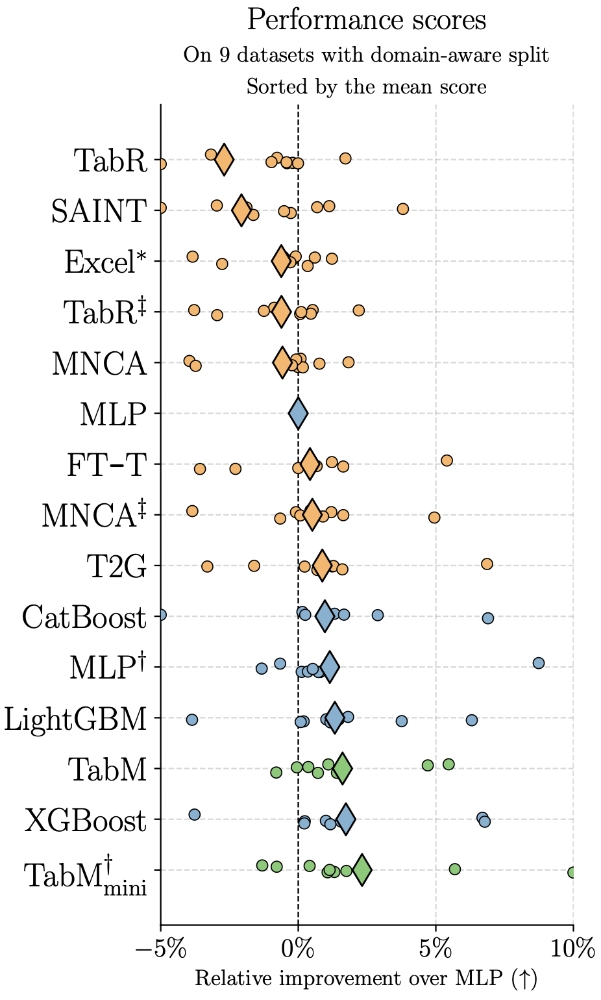
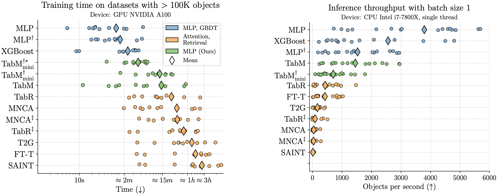
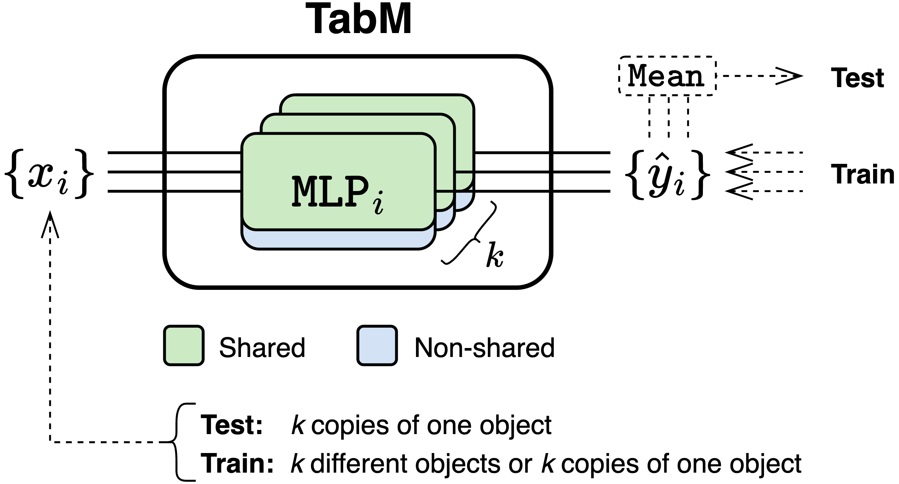

# TabM: Advancing Tabular Deep Learning With Parameter-Efficient Ensembling" (ICLR 2025)<!-- omit in toc -->

:scroll: [arXiv](https://arxiv.org/abs/2410.24210)
&nbsp; :books: [Other tabular DL projects](https://github.com/yandex-research/rtdl)

This is the official repository of the paper "TabM: Advancing Tabular Deep Learning With
Parameter-Efficient Ensembling".
It consists of two parts:
- [**Python package**](#python-package) described in this document.
- [**Paper-related content**](./paper/README.md) (code, metrics, hyperparameters, etc.) described in `paper/README.md`.

<br>

<details>
<summary>TabM on <b>Kaggle</b> (as of June 2025)</summary>

- TabM was used in [the winning solution](https://www.kaggle.com/competitions/um-game-playing-strength-of-mcts-variants/discussion/549801) in the competition by UM.
- TabM was used in [the winning solution](https://www.kaggle.com/competitions/equity-post-HCT-survival-predictions/discussion/566550), as well as in the top-3, top-4, top-5 and many other solutions in the competition by CIBMTR. Later, it turned out that it was possible to achieve the [25-th place](https://www.kaggle.com/competitions/equity-post-HCT-survival-predictions/discussion/567863) out of 3300+ with only TabM, without ensembling it with other models.

</details>

<details>
<summary>TabM on <b>TabReD</b> (a challenging benchmark)</summary>

[TabReD](https://arxiv.org/abs/2406.19380) is a benchmark based on **real-world industrial datasets** with **time-related distribution drifts** and **hundreds of features**, which makes it more challenging than traditional benchmarks. The figure below shows that TabM achieves higher performance on TabReD (plus one more real-world dataset) compared to prior tabular DL methods.



*One dot represents a performance score on one dataset. For a given model, a diamond represents the mean value across the datasets.*

</details>

<details>
<summary>Training and inference efficiency</summary>

TabM is a simple and reasonably efficient model, which makes it suitable for **real-world applications**, including large datasets. The biggest dataset used in the paper contains **13M objects**, and we are aware of a successful training run on **100M+ objects**, though training takes more time in such cases.

The figure below shows that TabM is relatively slower than MLPs and GBDT, but faster than prior tabular DL methods. Note that (1) the inference throughput was measured on a single CPU thread and *without any optimizations*, in particular without the TabM-specific acceleration technique described later in this document; (2) the left plot uses the *logarithmic* scale.



*One dot represents a measurement on one dataset. For a given model, a diamond represents the mean value across the datasets. In the left plot,* $\mathrm{TabM_{mini}^{\dagger*}}$ *denotes* $\mathrm{TabM_{mini}^{\dagger}}$ *trained with mixed precision and `torch.compile`.*

</details>

# TL;DR<!-- omit in toc -->



**TabM** (**Tab**ular DL model that makes **M**ultiple predictions) is a simple and powerful tabular DL architecture that efficiently imitates an ensemble of MLPs. The two main differences of TabM compared to a regular ensemble of MLPs:
- **Parallel training** of the MLPs. This allows monitoring the performance of the ensemble during the training and stopping the training when it is optimal for the ensemble, not for individual MLPs.
- **Weight sharing** between the MLPs. In fact, the whole TabM fits in just *one* MLP-like model. Not only this significantly improves the runtime and memory efficiency, but also turns out to be an effective regularization leading to better task performance.

# Reproducing experiments and browsing results<!-- omit in toc -->

> [!IMPORTANT]
> To use TabM in practice and for future work, use the `tabm` package described below.

The [paper-related content](./paper/README.md) (code, metrics, hyperparameters, etc.) is located in the `paper/` directory and is described in `paper/README.md`.

# Python package<!-- omit in toc -->

`tabm` is a PyTorch-based Python package providing the TabM model, as well as layers and tools for building custom TabM-like architectures (i.e. efficient ensembles of MLP-like models).

- [**Installation**](#installation)
- [**Basic usage**](#basic-usage)
    - [Creating TabM](#creating-tabm)
    - [Creating TabM with feature embeddings](#creating-tabm-with-feature-embeddings)
    - [Using TabM with custom inputs and input modules](#using-tabm-with-custom-inputs-and-input-modules)
    - [Training](#training)
    - [Inference](#inference)
- [**Examples**](#examples)
- [Advanced usage](#advanced-usage)
    - [Intuition](#intuition)
    - [`EnsembleView`](#ensembleview)
    - [MLP ensembles](#mlp-ensembles)
    - [Important implementation details](#important-implementation-details)
    - [Example: Simple ensemble without weight sharing](#example-simple-ensemble-without-weight-sharing)
    - [Example: MiniEnsemble](#example-miniensemble)
    - [Example: BatchEnsemble](#example-batchensemble)
    - [Example: a custom architecture](#example-a-custom-architecture)
    - [Turning an existing model to an efficient ensemble](#turning-an-existing-model-to-an-efficient-ensemble)
- [Hyperparameters](#hyperparameters)
    - [Default model](#default-model)
    - [Default optimizer](#default-optimizer)
    - [`arch_type`](#arch_type)
    - [`k`](#k)
    - [`num_embeddings`](#num_embeddings)
    - [Initialization](#initialization)
    - [Hyperparameter tuning](#hyperparameter-tuning)
- [Practical notes](#practical-notes)
    - [Inference efficiency](#inference-efficiency)
- [API](#api)

# **Installation**

```
pip install tabm
```

# **Basic usage**

This section shows how to create a model in typical use cases, and gives high-level comments on
training and inference.

## Creating TabM

The below example showcases the basic version of TabM without feature embeddings.
For better performance, `num_embeddings` should usually be passed as explained in the next section.

> [!NOTE]
> `TabM.make(...)` used below adds default hyperparameters based on the provided arguments.

<!-- test main -->
```python
import torch
from tabm import TabM

# >>> Common setup for all subsequent sections.
d_out = 1  # For example, one regression task.
batch_size = 256

# The dataset has 24 numerical (continuous) features.
n_num_features = 24

# The dataset has 2 categorical features.
# The first categorical feature has 3 unique categories.
# The second categorical feature has 7 unique categories.
cat_cardinalities = [3, 7]
# <<<

model = TabM.make(
    n_num_features=n_num_features,
    cat_cardinalities=cat_cardinalities,  # One-hot encoding will be used.
    d_out=d_out,
)
x_num = torch.randn(batch_size, n_num_features)
x_cat = torch.column_stack([
    # The i-th categorical features must take values in range(0, cat_cardinalities[i]).
    torch.randint(0, c, (batch_size,)) for c in cat_cardinalities
])
y_pred = model(x_num, x_cat)

# TabM represents an ensemble of k models, hence k predictions per object.
assert y_pred.shape == (batch_size, model.k, d_out)
```

## Creating TabM with feature embeddings

On typical tabular tasks, the best performance is usually achieved by passing feature embedding
modules as `num_embeddings` (in the paper, TabM with embeddings is denoted as $\mathrm{TabM^\dagger}$). `TabM` supports several feature embedding modules from the
[`rtdl_num_embeddings`](https://github.com/yandex-research/rtdl-num-embeddings/blob/main/package/README.md)
package. The below example showcases the simplest embedding module `LinearReLUEmbeddings`.

> [!TIP]
> The best performance is usually achieved with more advanced embeddings, such as
> `PiecewiseLinearEmbeddings` and `PeriodicEmbeddings`. Their usage is covered in the end-to-end usage [example](#examples).

<!-- test main _ -->
```python
from rtdl_num_embeddings import LinearReLUEmbeddings

model = TabM.make(
    n_num_features=n_num_features,
    num_embeddings=LinearReLUEmbeddings(n_num_features),
    d_out=d_out
)
x_num = torch.randn(batch_size, n_num_features)
y_pred = model(x_num)

assert y_pred.shape == (batch_size, model.k, d_out)
```

## Using TabM with custom inputs and input modules

> [!TIP]
> The implementation of `tabm.TabM` is a good example of defining inputs and input modules in
> TabM-based models.

Assume that you want to change what input TabM takes or how TabM handles the input, but you still
want to use TabM as the backbone. Then, a typical usage looks as follows:

```python
from tabm import EnsembleView, make_tabm_backbone, LinearEnsemble


class Model(nn.Module):
    def __init__(self, ...):
        # >>> Create any custom modules.
        ...
        # <<<

        # Create the ensemble input module.
        self.ensemble_view = EnsembleView(...)
        # Create the backbone.
        self.backbone = make_tabm_backbone(...)
        # Create the prediction head.
        self.output = LinearEnsemble(...)

    def forward(self, arg1, arg2, ...):
        # Transform the input as needed to one tensor.
        # This step can include feature embeddings
        # and all other kinds of feature transformations.
        # `handle_input` is a hypothetical user-defined function.
        x = handle_input(arg1, arg2, ...)  # -> (B, D) or (B, k, D)

        # The only difference from conventional models is
        # the call of self.ensemble_view.
        x = self.ensemble_view(x)  # -> (B, k, D)
        x = self.backbone(x)
        x = self.output(x)
        return x  # -> (B, k, d_out)
```

> [!NOTE]
> Regarding the shape of `x` in the line `x = handle_input(...)`:
> - TabM can be used as a conventional MLP-like backbone, which corresponds to `x` having the
>   standard shape `(B, D)` during both training and inference. This approach is recommended by
>   default due to its simplicity and better efficiency.
> - There is also an advanced training strategy, where the shape of `x` is `(B, k, D)`
>   during training and `(B, D)` during inference.
>
> The end-to-end usage [example](#examples) covers both approaches.

## Training

**It is crucial to train the `k` predictions of TabM indepedendently without averaging them.**
In other words, the *mean loss* must be optimized, *not* the loss of the mean prediction. The
end-to-end usage [example](#examples) provides a complete reference on how to train TabM.

## Inference

On inference, to obtain a prediction for a given object, average the `k` predictions. The exact
averaging strategy depends on the task and loss function. For example, on classification tasks,
*probabilities* should usually be averaged, not logits. The end-to-end usage [example](#examples) shows how to make predictions with TabM.

# **Examples**

`example.ipynb` provides an end-to-end example of training TabM:
- [View on GitHub](./example.ipynb)
- [Open in Colab](https://colab.research.google.com/github/yandex-research/tabm/blob/main/example.ipynb)

# Advanced usage

> [!TIP]
> Try and tune TabM before building custom models. The simplicity of TabM can be deceptive, while in
> fact it is a strong baseline despite using the vanilla MLP as the base model.

This part of the package goes beyond the TabM paper and provides building blocks for creating
custom TabM-like architectures, including:
- Efficient ensembles of MLPs, linear layers and normalization layers.
- Other layers useful for efficient ensembles, such as `EnsembleView` and `ElementwiseAffine`.
- Functions for converting single models to efficient ensembles in-place.
- And other tools.

Some things are discussed in dedicated sections, and the rest is shown in the examples below.

> [!IMPORTANT]
> Understanding the implementation details of TabM is important for constructing *correct* and
> *effective* TabM-like models. Some of them are discussed later in this section. Other important
> references:
> - The source code of this package, in particular the `TabM` model and the `make_tabm_backbone`
>   function.
> - The TabM paper, in particular the $\mathrm{TabM_{mini}}$ paragraph of Section 3.3 (arXiv v3).

## Intuition

Recall that, in conventional MLP-like models, a typical module represents one layer applied to
a tensor of the shape `(B, D)`, where `B` is the batch size and `D` is the latent representation
size. By contrast, a typical module in this package:
- Represents an ensemble of `k` layers applied in parallel to `k` inputs.
- Operates on tensors of the shape `(B, k, D)` representing `k` inputs (one per layer).

Examples:
- `LinearEnsemble` is an ensemble of `k` independent linear layers.
- `LinearBatchEnsemble` is an ensemble of `k` linear layers sharing most of their weights. Note that
  weight sharing does not change how the module is applied: it still represents `k` layers operating
  in parallel over `k` inputs.

## `EnsembleView`

`EnsembleView` is a special lightweight module doing one simple thing:
- Tensors of the shape `(B, D)` are turned to tensors of the shape `(B, k, D)` storing `k` identical
  views of the original tensor. This is a cheap copy-free operation.
- Tensors of the shape `(B, k, D)` are propagated as-is without any changes.

## MLP ensembles

The package provides the following efficient MLP ensembles:
- `MLPBackboneBatchEnsemble` (used by $\mathrm{TabM}$)
- `MLPBackboneMiniEnsemble` (used by $\mathrm{TabM_{mini}}$)
- `MLPBackboneEnsemble` (used by $\mathrm{TabM_{packed}}$)

> [!NOTE]
> The difference between creating the above ensembles directly or with the `tabm.make_tabm_backbone`
> function is that certain details in `make_tabm_backbone` are optimized for TabM. Those details
> may be useful outside of TabM, too, but this is not explored.

Contrary to `TabM`, they accept only one three-dimensional input of the shape `(batch_size, k, d)`.
Thus, a user is responsible for converting the input to one tensor (e.g. using embeddings, one-hot
encoding, etc.) storing either `k` views of the same object or `k` full-fledged batches. A basic
usage example:

<!-- test main -->
```python
import tabm
import torch
import torch.nn as nn

d_in = 24
d_out = 1
k = 32
model = nn.Sequential(
    tabm.EnsembleView(k=k),
    tabm.MLPBackboneBatchEnsemble(
        d_in=d_in,
        n_blocks=3,
        d_block=512,
        dropout=0.1,
        k=k,
        tabm_init=True,
        scaling_init='normal',
        start_scaling_init_chunks=None,
    ),
    tabm.LinearEnsemble(512, d_out, k=k)
)
x = torch.randn(batch_size, d_in)
y_pred = model(x)
assert y_pred.shape == (batch_size, k, d_out)
```

## Important implementation details

This section covers implementation details that are important for building custom TabM-like models.

**The order of layers.** The most important guideline is that **the $k$ different object representations
should be created before the tabular features are mixed with linear layers**. This follows directly
from the $\mathrm{TabM_{mini}}$ paragraph of Section 3.3 of the paper (arXiv V3).

```python
d_in = 24
d = 512
k = 16

# GOOD: collectively, the first two modules create k
# different object representations before the first
# linear layer.
scaling_init = "normal"  # or "random-signs"
good_model = nn.Sequential(
    tabm.EnsembleView(k=k),
    tabm.ElementwiseAffine((k, d_in), bias=False, scaling_init=scaling_init),
    nn.Linear(d_in, d),
    ...
)

# GOOD: internally, LinearBatchEnsemble starts with a
# non-shared elementwise scaling, which diversifies
# the k object representations before the
# linear transformation.
scaling_init = "normal"  # or "random-signs"
                         # or ("normal", "ones")
                         # or ("random-signs", "ones")
good_model = nn.Sequential(
    tabm.EnsembleView(k=k),
    tabm.LinearBatchEnsemble(d_in, d, k=k, scaling_init=scaling_init),
    ...
)

# BAD: the tabular features are mixed before
# the ensemble starts.
bad_model = nn.Sequential(
    nn.Linear(d_in, d),
    tabm.EnsembleView(k=k),
    nn.ReLU(),
    ...
)

# BAD: the k representations are created before the
# first linear transformations, but these representations
# are not different. Mathematically, the below snippet is
# equivalent to the previous one.
bad_model = nn.Sequential(
    tabm.EnsembleView(k=k),
    nn.Linear(d_in, d),
    nn.ReLU(),
    ...
)
```

**Weight sharing.** When choosing between `torch.nn.Linear` (fully sharing linear layers between
ensemble members), `tabm.LinearBatchEnsemble` (sharing most of the weights) and
`tabm.LinearEnsemble` (no weight sharing), keep in mind that parameter-efficient ensembling
strategies based on weight sharing (e.g. BatchEnsemble and MiniEnsemble) not only significantly
improve the efficiency of TabM, but also improve its task performance. Thus, weight sharing seems
to be an effective regularization. However, it remains underexplored what is the optimal "amount" of
this regularization and how it depends on a task.

## Example: Simple ensemble without weight sharing

The following code is a reimplementation of `tabm.MLPBackboneEnsemble`:

<!-- test main _ -->
```python
k = 32
d_in = 24
d = 512
d_out = 1
dropout = 0.1

model = nn.Sequential(
    tabm.EnsembleView(k=k),

    # >>> MLPBackboneEnsemble(n_blocks=2)
    tabm.LinearEnsemble(d_in, d, k=k),
    nn.ReLU(),
    nn.Dropout(dropout),

    tabm.LinearEnsemble(d, d, k=k),
    nn.ReLU(),
    nn.Dropout(dropout),
    # <<<

    tabm.LinearEnsemble(d, d_out, k=k),
)
```

## Example: MiniEnsemble

MiniEnsemble is a simple parameter-efficient ensembling strategy:
1. Create $k$ different representations of an object by passing it through $k$ non-shared randomly
   initialized affine transformations.
2. Pass the $k$ representations in parallel through one shared backbone. Any backbone can be used.
3. Make predictions with non-shared heads.

The code below is a reimplementation of `tabm.MLPBackboneMiniEnsemble`. In fact,
`backbone` can be any MLP-like model. The only requirement for `backbone` is to support an arbitrary
number of batch dimensions, since `EnsembleView` adds a new dimension. Alternatively, one can
reshape the representation before and after the backbone.

<!-- test main _ -->
```python
d_in = 24
d = 512
d_out = 1
k = 32

# Any MLP-like backbone can be used.
backbone = tabm.MLPBackbone(
    d_in=d_in, n_blocks=2, d_block=d, dropout=0.1
)
model = nn.Sequential(
    tabm.EnsembleView(k=k),

    # >>> MLPBackboneMiniEnsemble
    tabm.ElementwiseAffine((k, d_in), bias=False, scaling_init='normal'),
    backbone,
    # <<<

    tabm.LinearEnsemble(d, d_out, k=k),
)
```

## Example: BatchEnsemble

The following code is a reimplementation of `tabm.MLPBackboneBatchEnsemble` with `n_blocks=2`:

<!-- test main _ -->
```python
k = 32
d_in = 24
d = 512
dropout = 0.1
tabm_init = True  # TabM-style initialization
scaling_init = 'normal'  # or 'random-signs'

model = nn.Sequential(
    tabm.EnsembleView(k=k),

    # >>> MLPBackboneBatchEnsemble(n_blocks=2)
    tabm.LinearBatchEnsemble(
        d_in, d, k=k,
        scaling_init=(scaling_init, 'ones') if tabm_init else scaling_init,
    ),
    nn.ReLU(),
    nn.Dropout(dropout),

    tabm.LinearBatchEnsemble(
        d, d, k=k,
        scaling_init='ones' if tabm_init else scaling_init
    ),
    nn.ReLU(),
    nn.Dropout(dropout),
    # <<<

    tabm.LinearEnsemble(d, d_out, k=k),
)
```

## Example: a custom architecture

A random and most likely **bad** architecture showcasing various layers available in the package:

<!-- test main _ -->
```python
d_in = 24
d = 512
d_out = 1
k = 16
dropout = 0.1

model = nn.Sequential(
                                         #    (B, d_in) or (B, k, d_in)
    tabm.EnsembleView(k=k),              # -> (B, k, d_in)

    # Most of the weights are shared
    tabm.LinearBatchEnsemble(            # -> (B, k, d)
        d_in, d, k=k, scaling_init=('random-signs', 'ones')
    ),
    nn.ReLU(),                           # -> (B, k, d)
    nn.Dropout(dropout),                 # -> (B, k, d)

    # No weight sharing
    tabm.BatchNorm1dEnsemble(d, k=k),    # -> (B, k, d)

    # No weight sharing
    tabm.LinearEnsemble(                 # -> (B, k, d)
        d, d, k=k
    ),
    nn.ReLU(),                           # -> (B, k, d)
    nn.Dropout(dropout),                 # -> (B, k, d)

    # The weights are fully shared
    nn.Linear(                           # -> (B, k, d)
        d, d,
    ),
    nn.ReLU(),                           # -> (B, k, d)
    nn.Dropout(dropout),                 # -> (B, k, d)

    # No weight sharing
    tabm.ElementwiseAffine(              # -> (B, k, d)
        (k, d), bias=True, scaling_init='normal'
    ),

    # The weights are fully shared
    tabm.MLPBackbone(                    # -> (B, k, d)
        d_in=d, n_blocks=2, d_block=d, dropout=0.1
    ),

    # Almost all the weights are shared
    tabm.MLPBackboneMiniEnsemble(        # -> (B, k, d)
        d_in=d, n_blocks=2, d_block=d, dropout=0.1,
        k=k, affine_bias=False, affine_scaling_init='normal',
    ),

    # No weight sharing
    tabm.LinearEnsemble(d, d_out, k=k),  # -> (B, k, d_out)
)

x = torch.randn(batch_size, d_in)
y_pred = model(x)
assert y_pred.shape == (batch_size, k, d_out)
```

## Turning an existing model to an efficient ensemble

> [!WARNING]
> The approach discussed below requires full understanding of all implementation details of both
> the original model and efficient ensembling, because it does not provide any guarantees on
> correctness and performance of the obtained models.

Assume that you have an MLP-like model, and you want to quickly evaluate the potential of efficient
ensembling applied to your model without changing the model's source code. Then, you can create a
single-model instance and turn it to an efficient ensemble by replacing its layers with their
ensembled versions. To that end, the package provides the following functions:
- `tabm.batchensemble_linear_layers_`
- `tabm.ensemble_linear_layers_`
- `tabm.ensemble_batchnorm1d_layers_`
- `tabm.ensemble_layernorm_layers_`

For example, the following code creates a full-fledged ensemble of $k$ independent MLPs:

<!-- test main _ -->
```python
d_in = 24
d = 512
d_out = 1

# Create one standard MLP backbone.
backbone = tabm.MLPBackbone(
    d_in=d_in, n_blocks=3, d_block=d, dropout=0.1
)

# Turn the one backbone into an efficient ensemble.
k = 32
tabm.ensemble_linear_layers_(backbone, k=k)

# Compose the final model.
model = nn.Sequential(
    tabm.EnsembleView(k=k),
    backbone,
    tabm.LinearEnsemble(d, d_out, k=k),
)
assert model(torch.randn(batch_size, d_in)).shape == (batch_size, k, d_out)
```

# Hyperparameters

## Default model

`TabM.make` allows one to create TabM with the default hyperparameters and overwrite them as needed:

> [!NOTE]
> The default hyperparameters are not "constant", i.e. they depend on the provided arguments.

<!-- test main _ -->
```python
# TabM with default hyperparameters.
model = TabM.make(n_num_features=16, d_out=1)

# TabM with custom n_blocks
# and all other hyperparameters set to their default values.
model = TabM.make(n_num_features=16, d_out=1, n_blocks=2)
```

## Default optimizer

Currently, for the default TabM, the default optimizer is
`torch.optim.AdamW(..., lr=0.002, weight_decay=0.0003)`.

## `arch_type`

*TL;DR: by default, use TabM.*

- `'tabm'` is the default value and is expected to provide the best performance in most cases.
- `'tabm-mini'` may result in a faster training and/or inference without a significant performance
  drop, though this option may require a bit more precision when choosing `d_block` and `n_blocks`
  for a given `k`. `'tabm-mini'` can occasionally provide slightly better performance if the
  higher degree of regularization turns out to be beneficial for a given task.
- `'tabm-packed'` is implemented only for completeness. In most cases, it results in a slower,
  heavier and weaker model.

## `k`

> [!TIP]
> All the following points about `k`, except for the first one, are inspired by Figure 7 from the
> paper (arXiv v3).

- If you want to tune `k`, consider running independent hyperparameter tuning runs with different,
  but *fixed* values of `k`. The motivation is that changing `k` can affect optimal
  values of other hyperparameters, which can hinder the hyperparameter tuning process if `k` is
  tuned together with other hyperparameters.
- For given depth and width, increasing `k` up to a certain threshold can improve performance.
  After the threshold, the performance may not improve and can even become worse. This effect is
  more pronounced for `arch_type='tabm-mini'` (not shown in the figure).
- For exploration purposes, one can use lower values of `k` (i.e. 24 or 16) and still get
  competitive results (though changing `k` can require retuning other hyperparameters).
- As a rule of thumb, if you increase `k`, consider increasing `d_block` or `n_block` (or both).
  The intuition is that, because of the weight sharing, the larger ensemble size may require
  larger base architecture to successfully accommodate `k` submodels.
- If the size of your dataset is similar to datasets used in the paper,
  `n_blocks=1` should usually be avoided unless you have high budget on hyperparameter tuning.

## `num_embeddings`

- Historically, the piecewise-linear embeddings seem to be a more popular choice among users.
  However, on some tasks, the periodic embeddings can be a better choice.
- The documentation of the `rtdl_num_embeddings` package provides recommendations on hyperparameter
  tuning for embeddings.

## Initialization

This section provides an overview of initialization-related options that one has to specify when
using API other than `TabM.make`.

> [!NOTE]
> The extent to which the initialization-related settings affect the task performance depends on
> a task at hand. Usually, these settings are about uncovering the full potential of TabM, not
> about avoiding some failure modes.

**TabM-style initialization**. `tabm_init` is a flag triggering the TabM-style initialization of
BatchEnsemble-based models. In short, this is a conservative initialization strategy making the $k$
submodels different from each other only in the very first ensembled layer, but equal in all other
layers *at initialization*. On benchmarks, `tabm_init=True` showed itself as a better default
strategy. If the $k$ submodels collapse to the same model during training, try `tabm_init=False`.

**Initialization of scaling parameters**. The arguments `start_scaling_init`, `scaling_init` and `affine_scaling_init` are all about the same thing in slightly different contexts. TabM uses an
informal heuristic rule that can be roughly summarized as follows: use `"normal"` if there are
"non-trivial" modules before the TabM backbone (e.g. `num_embeddings`), and `"random-signs"`
otherwise. This is not a well-explored aspect of TabM.

**Initialization chunks.** The arguments like `start_scaling_init_chunks` or `scaling_init_chunks`
trigger a heuristic chunk-based initialization of scaling parameters, where the chunk sizes must sum
exactly to the backbone input size (i.e. `d_in`.) By default, in TabM, the "chunks" are defined
simply as feature representation sizes (see the `d_features` variable in `tabm.TabM.__init__`),
which means that, during the initialization, exactly one random scalar will be sampled per feature.
In other contexts, it may be unclear how to define chunks. In such cases, one possible approach is
to start with `None` and, if needed, try to find a better approach by trial and error.

## Hyperparameter tuning

> [!TIP]
> The general notes provided above will help you in automatic hyperparameter tuning as well.

It the paper, to tune TabM's hyperparameters, the
[TPE sampler from Optuna](https://optuna.readthedocs.io/en/stable/reference/samplers/generated/optuna.samplers.TPESampler.html)
was used with 100 iterations on smaller datasets, and 50 iterations on larger datasets.
If achieving the highest possible performance is not critical, then 30-50 iterations should result
in a somewhat reasonable configuration.

The below table provides the hyperparameter distributions used in the paper.
**Consider changing them based on your setup** and taking previous sections into
account, especially if the lower number of iterations is used.

| Hyperparameter | TabM                            | TabM w./ `PiecewiseLinearEmbeddings` |
| :------------- | :------------------------------ | :----------------------------------- |
| `k`            | `Const[32]` (not tuned)         | Same as for TabM                     |
| `n_blocks`     | `UniformInt[1, 5]`              | `UniformInt[1, 4]`                   |
| `d_block`      | `UniformInt[64, 1024, step=16]` | Same as for TabM                     |
| `lr`           | `LogUniform[1e-4, 5e-3]`        | Same as for TabM                     |
| `weight_decay` | `{0, LogUniform[1e-4, 1e-1]}`   | Same as for TabM                     |
| `n_bins`       | N/A                             | `UniformInt[2, 128]`                 |
| `d_embedding`  | N/A                             | `UniformInt[8, 32, step=4]`          |

# Practical notes

## Inference efficiency

As shown in Section 5.2 of the paper, one can prune a significant portion of TabM's submodels
(i.e. reduce `k`) *after* the training at the cost of a minor performance drop. In theory, there are
more advanced algorithms for selecting the best subset of submodels, such as the
[one by Caruana et al.](https://automl.github.io/amltk/latest/api/amltk/ensembling/weighted_ensemble_caruana/),
but they were not analyzed in the paper. Also, keep in mind that selecting, say, `k=8` submodels
after training with `k=32` will result in a better model than simply training with `k=8`.

# API

To explore the package API and docstrings, do one of the following:
- Clone this repository and run `make docs`.
- On GitHub, open the source code and use the symbols panel.
- In VSCode, open the source code and use the Outline view.

To list all available items without cloning or installing anything, run the following snippet:

```
uv run --no-project --with tabm python -c """
import tabm

for x in sorted(
    x
    for x in dir(tabm)
    if getattr(getattr(tabm, x), '__module__', None) == 'tabm'
    and not x.startswith('_')
):
    print(x)
"""
```
